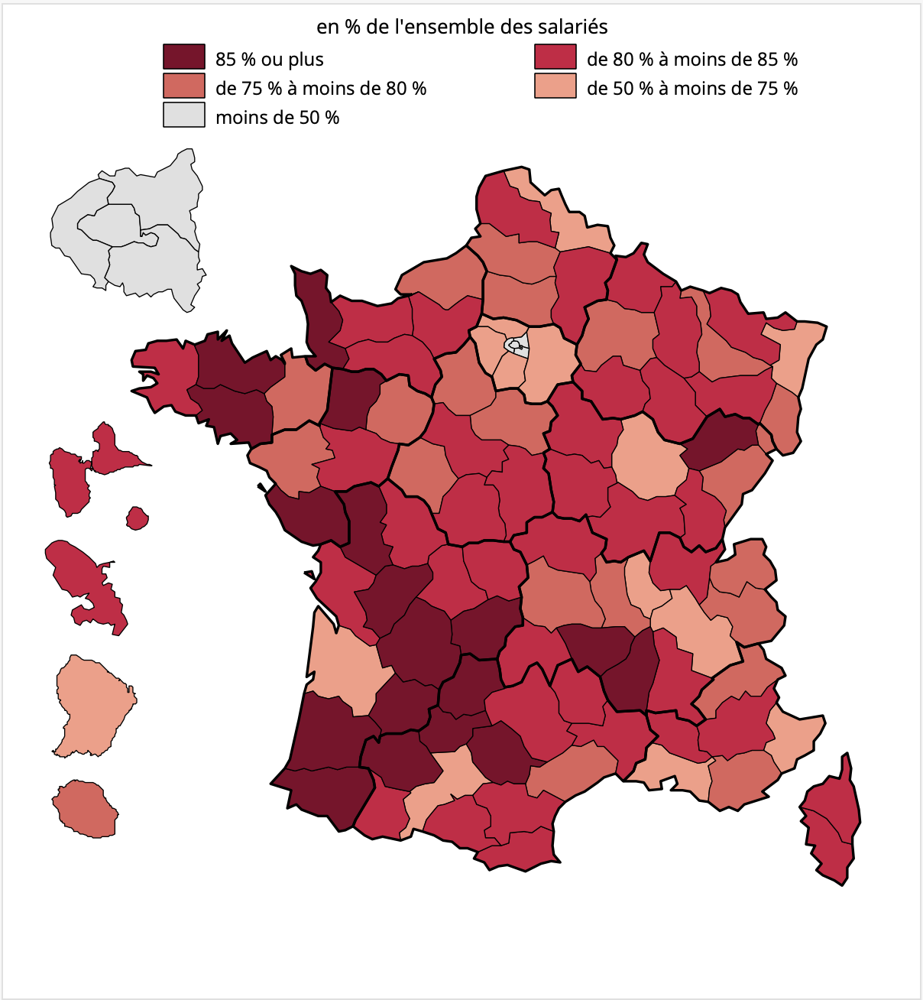
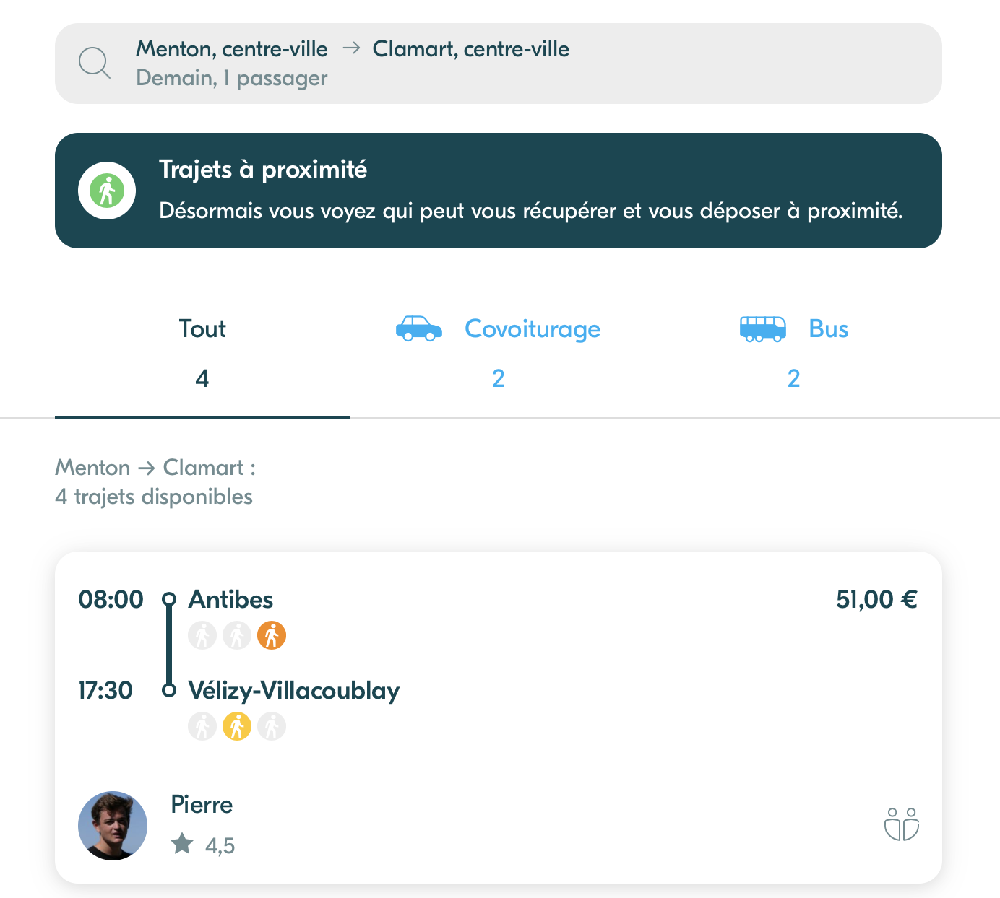
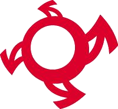

++++

++++

=== Description de la proposition

////
*_Note: 2 page max._*

_Décrire de façon détaillée votre projet : motivations de base/problèmes
constatés avant élaboration du projet, comment votre projet répond à ces
besoins. Ajouter une image ou une figure pour montrer à quoi cela
ressemble si besoin._

////

[.text-justify]
Nous évoquerons ici les problèmes que notre société peut rencontrer de nos jours concernant les transports et leurs impacts, sources de motivation pour le choix de ce sujet. Nous développerons ensuite les solutions que nous comptons apporter, en tâchant de toujours adopter une vision novatrice.
En effet, il nous semblait important d'essayer de *changer le quotidien de la plupart des personnes*, et c'est pour cela que nous nous sommes penchés sur la question des transports.
En outre, faciliter les tâches du quotidien s'avère d'ailleurs être l'une des principales "raisons d'être" du numérique.
{blank}
{blank}

==== Problématique sociétale : réduire la pollution des trajets en voiture
[.text-justify]
Nous avons essayé, lors de l'élaboration de notre sujet et de la recherche des idées, de mettre en évidence des *biais que la société rencontre* 
de nos jours, et de voir quels étaient les points sur lesquels nous pouvions agir de manière la plus *systémique* possible. Nous entendons, par systémique, le fait que l'action de résolution concerne directement la source du problème et agit de façon macroscopique dans le but d'avoir le plus grand impact possible. +
Soucieux du futur, nous avons considéré que le développement durable serait un enjeu majeur dans les prochaines années, 
et voulions que notre projet serve la société - et plus largement l'humain - en s'inscrivant dans cette démarche.

[.text-justify]
Bien qu'il existe aujourd'hui des réseaux de transports en commun, ceux-ci restent encore peu développés dans les paysages péri-urbain, 
régions dans lesquelles la voiture est privilégiée. De plus, 70% des français se rendent à leur lieu de travail en voiture, 
ce qui en fait un mode de transport très largement utilisé dans notre société. Ainsi, se concentrer sur ce moyen de transport demeure, de nos jours, encore très pertinent, et beaucoup de biais semblent se présenter dans le domaine de l'automobile.

{blank}

// source insee : https://www.insee.fr/fr/statistiques/3714237

[.text-center]
._Carte représentant la proportion des salariés utilisant la voiture pour se rendre au travail en fonction des départements._ +

{blank}
[.text-justify]
Ainsi, la création du covoiturage était un premier pas fait dans l'optique de réduire la pollution liée à ces trajets en voiture.
Mais nous comptons ici aller plus loin en proposant une application de covoiturage qui proposerait quelque chose de nouveau : *la possibilité pour les usagers
de choisir les trajets en voiture les plus "_green_" possibles*, qui seraient déterminés en tenant compte du véhicule (puissance / taille / etc.), 
de la vitesse de déplacement ou encore de la longueur du trajet par exemple. Le choix de ces trajets, parfois plus longs en terme de durée, seraient motivés
en récompensant les conducteurs qui les emprunteraient avec des points leur permettant d'obtenir des réductions dans d'éventuels trajets à venir
où ils seraient cette fois passagers. 
[.text-justify]
Cela encourage donc le covoiturage, mais également le choix de trajets dont l'empreinte énergétique est moindre. Ainsi, cela entrainerait une réduction de la pollution liée aux trajets en voiture, ce qui serait bénéfique pour la société d'aujourd'hui et de demain.

{blank}

==== Problématique de l'individu : faciliter les trajets en voiture par covoiturage
[.text-justify]
Dans le cadre d'une application visant à améliorer les trajets automobiles que nous connaissons à l'heure actuelle, il nous semblait primordial que cette 
solution s'attaque au covoiturage, et de *manière intelligente*. L'importance de proposer les trajets répondant au mieux aux attentes des individus s'inscrit dans la volonté de voir augmenter significativement le nombre d'utilisateurs de ces 
applications. En effet, si aujourd'hui 900 000 personnes "covoiturent" chaque jour pour se rendre sur leur lieu de travail, l'objectif du gouvernement français 
est de faire grimper ces chiffres jusqu'à *trois millions par jours en 2024*. 
[.text-justify]
En effet, de nos jours *aucune application de covoiturage ne propose aux usagers la possibilité de faire des correspondances*,
ce qui se traduit parfois par des trajets où le voyageur doit se rendre, en amont, loin de chez lui pour rejoindre le conducteur, 
et arrive loin du lieu d'arrivée. Cela l'oblige donc à reprendre un autre moyen de transport pour enfin arriver à sa destination finale, et engendre une forte complexité de déplacement, qui n'est en aucun souhaitable.

{blank}

// source : gouvernement :https://www.ecologie.gouv.fr/covoiturage-en-france-avantages-et-reglementationen-vigueur

[.text-center]
.Exemple d'un trajet en covoiturage sans correspondances

{blank}
[.text-justify]
Ci dessus, un utilisateur veut se déplacer de la ville de Menton à celle de Clamart, ce qui correspond à environ
une heure de voiture ou autant de train. À l'arrivée, le passager doit encore se déplacer de Vélizy-Villacoublay à Clamart, ce qui correspond à une vingtaine 
de minutes en voiture ou le double en transports en commun. Ainsi, aux 9h30 de trajet en covoiturage s'ajoutent presque deux heures de transport, que nous qualifierons d'évitables, grâce à notre application+
[.text-justify]
C'est aussi en cela que notre application se veut novatrice. En effet, pour faciliter les déplacements des usagers déjà adeptes du covoiturage,
mais aussi pour encourager ceux qui ne l'utilisent pas (souvent par manque de practicité), nous avons voulu ajouter à l'application la possibilité de *faire des
correspondances* pour relier un lieu de départ et une destination d'arrivée lorsqu'un trajet direct n'est pas disponible.
Cela pourrait dans un premier temps faire gagner beaucoup de temps aux voyageurs mais aussi permettre aux conducteurs de prendre plus de passagers sur le trajet, 
leur faisant ainsi gagner davantage d'argent. Ainsi, la conséquence immédiate serait une baisse du coût du trajet pour le conducteur, et un impact environnemental amoindri.

////

=== Exemples d'utilisation d'AsciiDoc

_Ici quelques exemples de syntaxe AsciiDoc pour ajouter des équations, des images, des listes..._

_Ces exemples *ne doivent pas* être conservé dans la version finale du rapport._

==== Exemples d'équations

* Inline math: latexmath:[\int_{-\infty}^\infty g(x) dx]
Pour ajouter une équation ou un symbole mathématique dans le corps du texte.

* Block math pour avoir une équation centrée au milieu de la page:

[latexmath]
++++
\int_{-\infty}^\infty g(x) dx
++++

==== Exemples d'images

* Ceci est le logo de notre application:

image::../images/Capture_d_écran_2020-11-01_à_13.01.54.png[Notre logo pact,800,800]

* L'image peut être redimensionnée et avoir un titre:

* Pour le rapport, les images peuvent être aux formats jpeg, png ou même *svg*:

* Les images peuvent aussi être mises dans le corps du texte par exemple .

==== Exemples de code

On peut ajouter des blocs de code formatés en précisant le langage utilisé:

[source,python]
----
def func(i):
   x = 3 + i
   return x

for i in range(10):
   print "---> ", func(i)
----

[source,java]
----
class foo {
   Integer i;
   String s;
}
----

==== Exemples de listes

* AAAA
** aaaaa
*** axaxax
** bbbbb
** ccccc
* BBBB
* CCCC

'''''

.  AAAA
..  aaaa
..  bbbb
.  BBBB
.  CCCC

'''''

.Liste des tâches à faire:
*  [ ] Pas encore fait
** [ ] étape X
** [x] étape Y (a démarré en avance)
** [ ] étape Z
*  [x] Complètement finit
** [x] étape Q
** [x] étape R
** [x] étape `finale` E=mc^2^

'''''

.Liste descriptive:

Étape 1::: Faire A, B, C…
Étape 2::: Faire X, Y, Z…
Étape 3::: Faire W, et c'est fini…

////