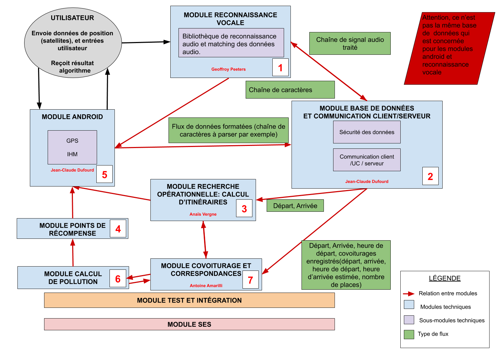
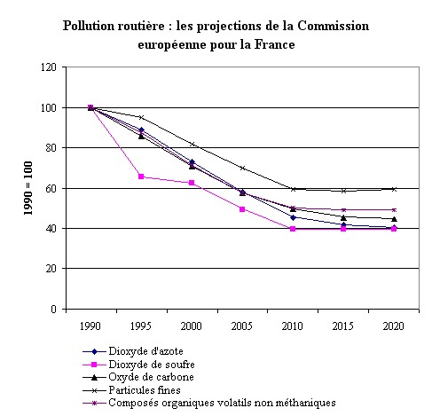

++++

++++

{blank}

=== Schéma d’architecture
//// 
Insérer ici un ou plusieurs schémas d’architecture du projet. Voir le
cours d’introduction au Génie Logiciel. N’hésitez pas à faire des
schémas hiérarchiques, c’est à dire avec un bloc d’un schéma général
raffiné dans un second schéma ; ou des schémas en plusieurs parties.

////

Voici un schéma (peu détaillé) du projet visualisé comme une interface Client/Serveur. Le choix de fusionner la partie unité de calcul et serveur est arbitraire.

[.text-center]
image::../images/Architecture.png[Interface Client/Serveur,400,270]

Ci-dessous, les relations entre les différents modules du projet:
{blank}
{blank}

[.text-center]

Lorsque les sous-modules techniques n'apparaissent pas, c'est qu'ils n'ont pas encore pu être déterminés.
{blank}
{blank}

==== Description des blocs
////
Il faut ici une description textuelle de chaque bloc, sa fonction
détaillée. En général, un bloc correspond à un module, sauf exception.
Il peut être adapté de faire des blocs plus petits qu’un module.

Il est important ici de distinguer les bibliothèques identifiées et
disponibles de ce que vous allez produire (coder) vous même. Vous ne
devez pas réinventer la roue mais vous ne devez pas non plus avoir votre
projet tout fait en encapsulant un programme déjà existant.

////
{blank}

===== Bloc 1: Reconnaissance vocale

Ce module permet à l'utilisateur la dictée vocale du trajet qu'il souhaite réaliser sous la séquence d'instructions suivante:  +

- "Ville de départ" : >> Nom d'une ville |ex: Paris  +
- "Ville d'arrivée" : >> Nom d'une ville |ex: Marseille   +
- "Heure de départ" : >> Heure énoncée   |ex:	dix-huit heures trente

Le sampling audio relevé est ensuite analysé par un algorithme de traitement de signal (rédigé en Python) afin de faire matcher les sons avec 
les prononciations de villes et heures correspondantes.
Une fois le matching établi, les données sont envoyées sous la forme d'une chaîne de caractères parsée à la base de données.  +

Eventuellement, il pourrait être nécessaire d'avoir une base de données à distance si les prononciations des différentes villes sont trop coûteuses
en espace mémoire.

{blank}

===== Bloc 2 : Base de données et Communication client serveur

A priori, il s'agira d'une architecture 3-tiers: le terme client fait référence à l'application sur smartphone.  +
Le terme serveur désigne la base de données (décrite ci-dessous).  +
Le serveur d'application est l'unité de calcul qui détermine les itinéraires et gère les correspondances.  +

Gestion de la base de données contenant les données des utilisateurs (probable utilisation de mySql) :

	* Profil associé au compte: Nom d'utilisateur, (Nom, Prénom  < optionnel ) , mot de passe, Numéro de téléphone, solde & coordonnées bancaires ?

	* Enregistrement des trajets proposés par les conducteurs : Lieu de départ, lieu d'arrivée, date de départ, nombre de places disponibles,
	montant à payer, id du trajet
	
	* Enregistrement des trajets réservés par les passagers :  id des trajets, Nombre de places réservées dans chaque trajet
	
	
Protection des données sensibles par implémentation d'un protocole réseau sûr (exemple SSL pour le paiement sécurisé). +
Communication avec l'application Android.

{blank}

===== Bloc 3 : Calcul d'itinéraire

Un utilisateur veut prendre sa voiture pour aller d'un point à un autre.
Le rôle de ce module est de fournir des itinéraires à partir de ces données en entrée. +

Les entrées sont : +

	* Le point de départ

	* La destination

	* L'heure de départ

	* L'heure d'arrivée +

Les sorties sont sous forme de liste des itinéraires possibles avec : +

	* Le temps de trajet

	* La distance à parcourir

	* Le coût du trajet

	* La pollution (déterminée par le module pollution) +

[.text-justify]
Ce module se basera sur des cartes, interrogées à distance. 
Il faut également optimiser le temps de calcul malgré la taille des cartes. 
Il faudra formater les itinéraires de sorte à ce qu'ils puissent être facilement exploitables par le module covoiturage. 
Le calcul d'itinéraires s'accompagne également de l'affichage de l'itinéraire pour guider le conducteur du point de départ au point d'arrivée. Il faut donc déterminer l'avancement du véhicule dans l'itinéraire et gérer les déviations que pourraient faire les conducteurs. 

{blank}

===== Bloc 4 : Module Points de récompense 

[.text-justify]
Dans ce module, nous allons gérer le transfert d'argent entre passager et conducteur. En effet, le covoiturage permet aussi de partager les frais de déplacement entre les différentes personnes dans une même voiture. 
Le calcul du prix à payer par les passagers dépendra de plusieurs paramètres comme le prix de l'essence pour arriver à destination, le prix de l'autoroute (si empruntée), ou encore le nombre de passagers. Une fois le prix calculé par l'application, le conducteur pourra modifier le prix à la hausse ou à la baisse selon ses envies : le but n'est en effet pas d'imposer le prix du trajet au conducteur, qui peut, s'il le souhaite, même faire du bénéfice sur une session de covoiturage. 

[.text-justify]
De plus, afin de gérer au mieux le paiement, l'utilisateur souhaitant réserver un trajet paiera directement via l'application. Nous serons *intermédiaires*, c'est-à-dire que nous garderons l'argent jusqu'à ce que le trajet soit effectué. Une fois confirmation des différents utilisateurs, nous procéderons au transfert vers la cagnotte du conducteur. Il pourra alors soit la conserver, soit demander un transfert pour la récupérer sur son compte en fournissant ses coordonnées bancaires : cela nous permet donc de ne pas conserver en permanence ses informations confidentielles.

[.text-justify]
Dans ce module, nous établirons également un système de points de récompenses attribués aux utilisateurs. Par exemple, les conducteurs qui choisiront d'emprunter un itinéraire moins polluant, ou de prendre plusieurs passagers, seront récompensés par un certain nombre de points. Ainsi, en fixant des seuils de points à atteindre, un utilisateur pourra, une fois le seuil atteint, convertir ses points de récompense en réductions (par exemple 10% de rabais sur sa prochaine course). Cette réduction sera déduite des frais de gestion que tous les utilisateurs devrons payer (une petite commission applicable sur chaque trajet et pour chaque utilisateur, nécessaire au bon fonctionnement de l'application). Ainsi, un conducteur recevra plus d'argent et un demandeur de covoiturage (passager) payera moins pour le trajet en question.

{blank}

===== Bloc 5 : Module Android

Codage en Java de l'application sur Android pour l'utilisateur. Il s'agit d'une IHM.
Utilisation de Android SDK.

Seront implémentées les fenêtres suivantes:  

	- Authentification  +
	- Gestion du compte  (dont porte-monnaie ? )  +
	- Chercher un trajet  +
	- Proposer un covoiturage  +
	- Réserver un covoiturage (et réglement ? )  +
	- Visualiser les covoiturages enregistrés  +

{blank}

===== Bloc 6 : Module calcul de pollution

[.text-justify]
Ce module aura pour but de calculer la quantité de matière polluante émise sur un trajet. Il permettra au module de calcul d'itinéraires de proposer les itinéraires "_green_". Ce module permet également de traiter les données reçues pendant le trajet pour faire figurer aux utilisateurs la quantité de matière polluante évitée grâce à l'option de covoiturage (comparé à un trajet avec une seule personne par voiture). Le calcul de pollution prendra en compte plusieurs points :

	- Le type de véhicule utilisé (diesel, essence, date de conception du véhicule, électrique ou non, consommation de carburant moyenne...)
	- La vitesse du véhicule sur le trajet
	- L'état actuel du trafic
	- La charge du véhicule : nombre de personnes (et de bagages) à bord
	- Le nombre éventuel de feux rencontrés sur la route
	- Si la conduite est écologique ou pas (coup de frein, accélération brusque, par exemple)

[.text-justify]
Ce module prendra en compte les coordonnées GPS de l'utilisateur, notamment pour vérifier que le conducteur est bien passé par l'itinéraire le moins polluant (s'il l'avait choisi en amont).

[.text-justify]
Les calculs de pollution se baseront principalement sur l'émission de particules fines et de CO2. En effet, si l'émission de monoxyde de carbonne (CO) était la 
principale cause de pollution liée au trafic routier jusque dans les années 1990, l'émission de particules fines a aujourd'hui pris le dessus 
(signalons aussi le fait que l'achat des véhicules diesel, émettant plus de particules fines que les véhicules essence, 
a été fortement conseillés par le gouvernement).

[.text-center]
image::../images/Emissions_pollution.png[pollution, 450,450] 
[.text-center]
.Graphes représantant les émissions de polluants primaires liées au trafic routier en France depuis 1960

 

{blank}
{blank}

===== Bloc 7 : Module covoiturage

[.text-justify]
Ce module a pour but d’attribuer les meilleurs co-voiturages aux personnes en recherche, grâce à d’éventuelles correspondances. +

[.text-justify]
Pour une meilleure efficacité et mise en application de notre application nous utiliserons la base de données du leader français du co-voiturage Blablacar de la manière suivante: lorsqu’un utilisateur cherchera un itinéraire d’un point A à un point B, nos programmes vont solliciter cette base de données pour trouver un utilisateur qui va également de A à B, ou du moins qui passe par la portion de trajet A —> B. +

[.text-justify]
Pour effectuer ce type de démarche, nous devrons donc créer un autre algorithme qui permettra de trouver une liste de points géographiques pertinents à partir desquels nous effectuons les recherches d’itinéraire. Une fois cette étape achevée, notre deuxième algorithme cherchera des usagers passant par ces points géographique au bon moment sur Blablacar et proposera le meilleur trajet à l’utilisateur. 
	
